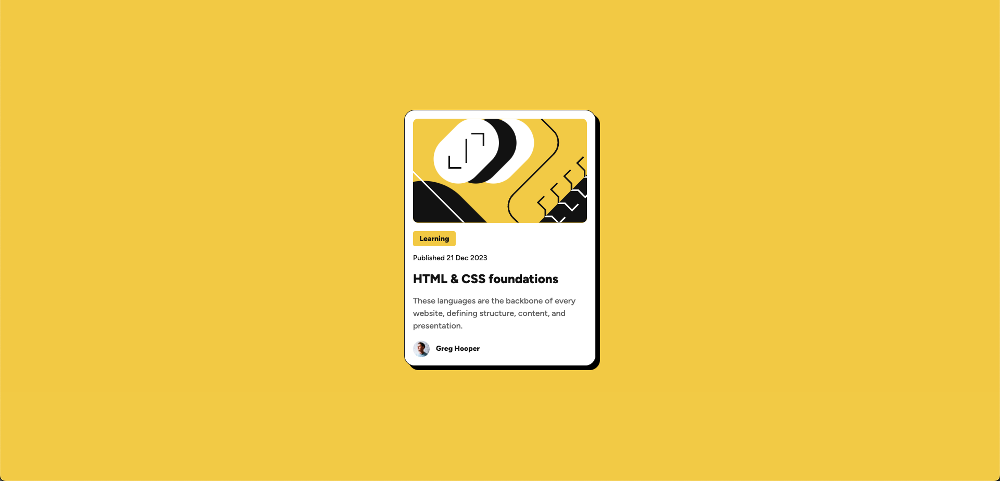

# Frontend Mentor - Blog Preview Card

## Table of contents

- [Overview 概覽](#overview_概覽)
  - [Screenshot 截圖](#screenshot_截圖)
  - [Links 連結](#links_連結)
- [My process 完成過程](#my-process_完成過程)

  - [Built with 使用技術](#built-with_使用技術)
  - [What I learned 學習收穫](#what-i-learned_學習收穫)
  - [Continued development 將來改進](#continued-development_將來改進)

- [Author 作者](#author作者)

## Overview\_概覽

This is a solution to the Blog Preview Card challenge from Frontend Mentor. The goal was to replicate the given design using HTML and CSS, improving frontend skills in the process.
這是 Frontend Mentor 提供的 Blog Preview Card 挑戰。目標是使用 HTML 和 CSS 來還原設計，並在過程中提升前端開發技能。

### Screenshot\_截圖

### Links\_連結

- Solution URL: [https://github.com/ylin320/Blog-preview-card](https://github.com/ylin320/Blog-preview-card)
- Live Site URL: [https://ylin320.github.io/Blog-preview-card/](https://ylin320.github.io/Blog-preview-card/)

## My process\_完成過程

### Built with\_使用技術

- Semantic HTML5 markup
- CSS custom properties
- Flexbox
- Figma for layout reference
- Responsive Design

### What I learned\_學習收穫

I learned how to use Figma to analyze and implement a design layout. This helped me improve my ability to translate design specifications into code. I will continue practicing to become more comfortable with frontend development.
我學習了如何使用 Figma 來分析並實現設計佈局，這幫助我提高了將設計規範轉換為程式碼的能力。我會繼續練習，以熟悉前端開發。

### Continued development\_將來改進

I noticed that some CSS styles are repeated in my code. In the future, I plan to optimize my styles and reduce redundancy by using better structuring techniques.
我發現我的 CSS 代碼中有幾個重複的部分。未來，我計畫優化樣式，減少重複，並使用更好的結構化方法來提升代碼品質。

## Author\_作者

- GitHub - [@ylin320](https://github.com/ylin320)
- Frontend Mentor - [@ylin320](https://www.frontendmentor.io/profile/ylin320)
